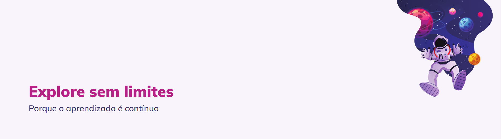

# Explore sem limites

  

## 🖥️ Projeto

Esse é um projeto Web responsivo de uma Landing page, esse projeto foi idealizado no intensivão da Rocketseat que aborda os assuntos dos níveis de 01 a 04.
Você poderá acessar o site através de qualquer dispositivo (Smartphone, Tablet ou Computador).

## 🚀 Tecnologias

- HTML
- CSS
- Figma

## 🏷️ Layout

Você pode visualizar o projeto através [desse link](<https://stage-05.vercel.app>).
